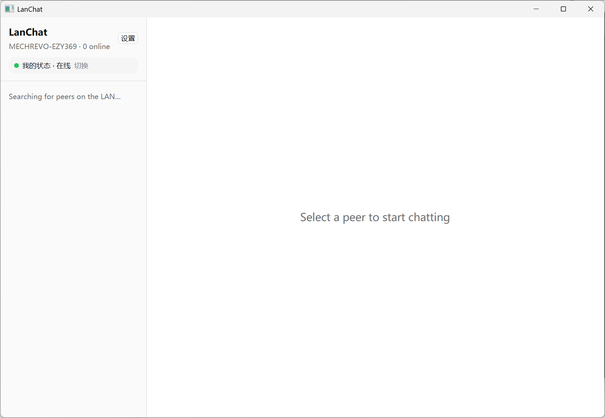

# LanChat

> **English (brief):** LanChat is an open-source, modern rewrite of the classic
> FeiQ / IP Messenger LAN messenger, written in Rust with the
> [GPUI](https://github.com/zed-industries/zed) UI framework. It speaks the
> IPMsg wire protocol (UDP/TCP port 2425) with FeiQ extensions, so it can
> discover and chat with existing FeiQ / IP Messenger clients on the same LAN —
> no server required. Features include automatic peer discovery, text chat with
> delivery & read receipts, typing indicators, screen-shake ("knock"), file and
> folder transfer with progress, persistent chat history with full-text search,
> presence status, a system tray, and desktop notifications. See the Chinese
> sections below for full details.

LanChat 是一个用 Rust + [GPUI](https://github.com/zed-industries/zed) 重写的开源局域网即时通讯工具，目标是成为经典「飞秋 / IP Messenger」的现代替代品。它实现 IPMsg 协议（UDP/TCP 2425 端口）及飞秋扩展，无需任何服务器，即可与同一局域网内的飞秋 / IP Messenger 客户端互相发现、聊天、传文件。



## 特性

- **零配置自动发现**：启动后通过 UDP 广播自动发现局域网内所有在线 peer，无需服务器或手动添加。
- **文本聊天**：与任意 peer 一对一聊天，Enter 发送。
- **送达 / 已读回执**：消息气泡显示发送中（…）、已送达（✓）、已读（✓✓）状态。
- **正在输入提示**：对方输入时显示 typing 指示。
- **抖屏（Knock）**：向对方发送抖屏，窗口抖动提醒。
- **文件 / 文件夹传输**：拖拽或选择文件、文件夹发送；接收方确认后通过 TCP 下载，带实时进度与保存路径提示。
- **聊天记录持久化**：消息存入本地 libSQL（嵌入式 SQLite），支持 FTS5 全文搜索与分页加载。
- **在线状态**：可设置并广播「在线 / 离开 / 忙碌」，对端正确着色显示。
- **系统托盘**：托盘图标常驻，左键唤起主窗口，右键菜单可显示窗口或退出。
- **桌面通知**：新消息、文件到达、传输完成时弹出系统通知。
- **设置面板**：可视化修改昵称、下载目录、端口，TOML 持久化到用户目录。

## 构建

前置条件：

- Rust 工具链 **1.85+**（`edition 2024`）。
- Git（GPUI 及其组件以 git 依赖引入，首次构建需联网拉取）。
- Windows / macOS（系统托盘与通知按平台门控；Linux 可编译核心但桌面集成未启用）。

```bash
git clone https://github.com/ezy369/lanchat
cd lanchat

# 开发运行
cargo run

# 发布构建
cargo build --release
```

运行测试与静态检查：

```bash
cargo test --workspace
cargo clippy --workspace
```

### 发布包

Windows `.msi`（在本仓库根目录执行，需先安装 [cargo-wix](https://github.com/cargo-wix/cargo-wix) 与 [WiX Toolset v3](https://github.com/wixtoolset/wix3)）：

```bash
cargo install cargo-wix
# 将 WIX 指向 WiX v3 的 bin 目录（含 candle.exe / light.exe）
cargo wix -p lanchat --nocapture
# 产物：target/wix/lanchat-<version>-x86_64.msi
```

安装器模板为 `wix/main.wxs`（开始菜单快捷方式、PATH 环境变量、`assets/icon.ico` 产品图标）。嵌入 exe 图标/版本信息由 `build.rs` 经 `winres` 完成，需要 Windows SDK 的 `rc.exe`；若未安装 SDK，资源步骤会被跳过（打印 warning），构建与打包仍可继续。

macOS `.dmg`（需在 Mac 上执行，依赖 Xcode command line tools）：

```bash
cargo install cargo-bundle
cargo bundle --release        # 元数据取自 Cargo.toml 的 [package.metadata.bundle]
# 产物：target/release/bundle/dmg/LanChat_<version>_aarch64.dmg（或 x86_64）
```

`.dmg` 无法在 Windows/Linux 上构建；仓库已提供 `cargo-bundle` 所需的 `[package.metadata.bundle]` 元数据与 `assets/icon_*.png`，在 Mac 上直接运行上述命令即可。

## 使用

1. 启动后左侧栏显示本机昵称与在线 peer 列表；新 peer 上线会自动出现。
2. 点击某个 peer 打开会话，输入框回车发送消息。
3. 拖拽文件到聊天窗口，或点击附件按钮选择文件 / 文件夹发送。
4. 收到文件时右下角弹出接收卡片，选择「接收」或「拒绝」；接收进度实时显示，完成后可打开所在文件夹。
5. 点击左上角状态胶囊可在「在线 / 离开 / 忙碌」间切换，并广播给所有 peer。
6. 点击「设置」打开设置面板，修改昵称 / 下载目录 / 端口（昵称与端口重启后生效，下载目录即时生效）。
7. 最小化后程序常驻系统托盘：左键托盘图标唤起窗口，右键菜单可退出。

配置文件位置：

- Windows：`%APPDATA%\LanChat\config.toml`
- macOS：`~/Library/Application Support/LanChat/config.toml`
- Linux：`$XDG_CONFIG_HOME/LanChat/config.toml` 或 `~/.config/LanChat/config.toml`

## 协议兼容性

LanChat 实现 IPMsg 协议（UDP 2425）及常用飞秋扩展，可与飞秋 / IP Messenger 互通。报文格式为：

```text
version:packet_no:sender_name:sender_host:command_no[:extra]
```

已实现的命令与标志：

| 类别 | 命令 / 标志 | 说明 |
| --- | --- | --- |
| 在线状态 | `BrEntry (0x01)` / `BrExit (0x02)` / `BrAbsence (0x04)` | 上线 / 下线 / 离开广播；飞秋上线附加 `FEIQ_ONLINE_FLAGS (0x600000)` |
| 消息 | `SendMsg (0x20)` / `RecvMsg (0x21)` / `ReadMsg (0x30)` | 发送、送达回执、已读回执 |
| 输入提示 | `TypingStart (0x79)` / `TypingEnd (0x7A)` | 飞秋扩展 |
| 抖屏 | `Knock (0xD1)` | 飞秋扩展 |
| 文件传输 | `GetFileData (0x60)` / `GetDirFiles (0x62)` / `ReleaseFiles (0x61)` | 单文件 / 目录递归下载、取消 |
| 编码 | `IPMSG_UTF8OPT (0x800000)` | 使用 UTF-8 而非系统 locale |

已知限制：

- IPMsg 协议线上没有独立的「忙碌」状态，「离开」与「忙碌」都以 `BrAbsence` 广播，因此对端会把两者都显示为离开。
- 群聊（`GroupMsg 0x23` + Blowfish 加密）尚未实现，列入后续里程碑。
- 图片消息（`SendImage 0xC0`）接收时以「[图片]」占位文本显示，暂不下载与渲染原图。

## 架构

多 crate 工作区，职责清晰分层：

| Crate | 职责 |
| --- | --- |
| `flyq-protocol` | IPMsg / 飞秋报文解析与构造（命令、标志、FeiQ 扩展） |
| `flyq-network` | UDP 发现与消息发送、TCP 文件传输、peer 生命周期管理 |
| `flyq-storage` | libSQL 持久化：消息、peer、会话摘要、FTS5 全文搜索、分页 |
| `flyq-core` | 业务编排：网络事件 → 存储 + UI 事件；配置持久化 |
| `flyq-ui` | GPUI 界面：侧栏、聊天面板、设置、托盘与通知接线 |
| `lanchat`（根 bin） | 启动引导：装配运行时、网络栈、存储与主窗口 |

事件流为单向数据流：

```text
DiscoveryService ──mpsc<DiscoveryEvent>──▶ EventHandler ──mpsc<UiEvent>──▶ GPUI UI
        ▲                                        │
        └──────── 发送（Arc<EventHandler>）──────┘
```

网络与存储运行在 Tokio 运行时上，通过 `flyq-ui::tokio_runtime` 桥接到 GPUI 的前台执行器；UI 事件经 `apply_event` 应用到实体状态并触发重绘。

## 许可

MIT（见各 crate 的 `Cargo.toml` 元数据）。
